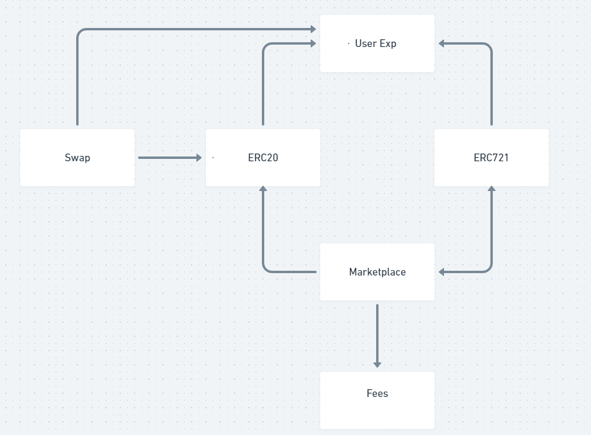

# xSRO Smart Contracts

## .env

```
INFURA_PROJECT_ID="YOUR_INFURA_API_KEY"
DEPLOYER_PRIVATE_KEY="YOUR_PRIVATE_KEY"
# Api key from the scan network you need to verify on
VERIFY_API_KEY="YOUR_SCAN_API_KEY"
# Options to enable (1) /disable (0)
CONTRACT_SIZER=1
REPORT_GAS=1
OPTIMIZER=1
DOCGEN=0
```

## Protocol



## Contracts

Réseau: Rinkeby

- [xSRO](https://rinkeby.etherscan.io/address/0x54aF871EceD37C5dCF87362452A751621D3AdCFe)
- [NFT](https://rinkeby.etherscan.io/address/0xAEDed2a8Dd9EF701A5A28D70c8B66E30AC37307d)
- [Marketplace](https://rinkeby.etherscan.io/address/0x20551A6ACFBE27963A2a3cd78923c6a6f66635B3)
- [Swap](https://rinkeby.etherscan.io/address/0x156D7635D30231B44016F0658D69F8ca9B6c2147)

## Scripts

- Deploy
  `npx hardhat run scripts/full-deploy.js --network NETWORK_NAME`

## Test

- xSRO
- NFT
- Marketplace
- Swap

# CMD

- deployment

1. `npx hardhat run scripts/deploy-xSRO.js --network NETWORK_NAME`
1. `npx hardhat run scripts/deploy-Swap.js --network NETWORK_NAME`

- verify

1. `npx hardhat verify --contract contracts/xSRO.sol:SarahRO --network NETWORK_NAME DEPLOYED_CONTRACT_ADDRESS`
1. `npx hardhat verify --contract contracts/NFT.sol:SRO721 --network NETWORK_NAME DEPLOYED_CONTRACT_ADDRESS "Marketplace deployed address"`
1. `npx hardhat verify --contract contracts/Marketplace.sol:Marketplace --network NETWORK_NAME DEPLOYED_CONTRACT_ADDRESS "xSRO deployed address"`
1. `npx hardhat verify --contract contracts/Swap.sol:SwapSRO --network NETWORK_NAME DEPLOYED_CONTRACT_ADDRESS "xSRO deployed address" "deployer address"`
