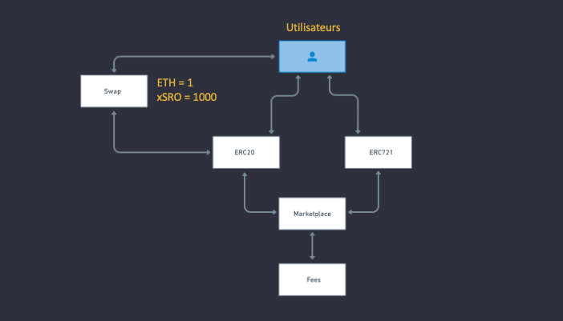

# Hardhat-SRO
<div>
<div align="center">
  
  </div>
    <h1 align="center"><b>Contrats SRO</b></h1>
    <div align="center">
    <a href="#contract-about">À propos</a> 
      |
    <a href="#contract-design">Architecture</a>
      |
    <a href="#contract-overview">Aperçu</a>
      |
    <a href="#contract-install">Installation et configuration</a>
  </div>
</div>
<div >
  <ul align="center">
    
    
    
    
    
  </ul>
</div>

----

<div>
  <h2><b>À propos</b></h2>
  <h4 id="contract-about" > <b>SarahRo</b> est une place de marché en ligne qui relie les artistes et les collectionneurs grâce à la technologie Blockchain pour vendre, investir et posséder facilement des œuvres d’art et des objets de collection en toute transparence. </h4>
  <p>
  Pour plus d'informations : 
    <ul>
    <li>Site - <a href="https://www.sarahro.io">sarahro.io</a></li>
    <li>Swap xSRO - <a href="https://www.swap.sarahro.io">swap.sarahro.io</a></li>
    <li>Marketplace SRO - <a href="https://www.apps.sarahro.io">apps.sarahro.io</a></li>
    <li>Documentations SRO - <a href="https://www.docs.sarahro.io">docs.sarahro.io</a></li>
    <li><a href="https://www.docs.sarahro.io">Repertoires GitHub</a></li>
    <ul>
      <li>Front - <a href="https://github.com/SRO-SarahRo/xsro-front">xsro-front</a></li>
      <li>Swap - <a href="https://github.com/SRO-SarahRo/xsro-swap">xsro-swap</a></li>
      <li>Contrats - <a href="https://github.com/SRO-SarahRo/xsro-contracts">xsro-contracts</a> </li>
      <li>Base de donnée - <a href="https://github.com/SRO-SarahRo/bdd-sro">bdd-sro</a> </li>
      <li>Documentations - <a href="https://github.com/SRO-SarahRo/doc.xsro">doc.xsro</a> </li>
    </ul>
  </ul>
  </p>
</div>

----

<div>
  </br>
    <h2 id="contract-design"><b>Architecture</b></h2>
  </br>
</div>

<div align="center">
  
</div>

----

<div>
  </br>
    <h2 id="contract-deployed_address"><b>Deployed_address</b></h2>
  </br>
</div>

Cette section contient la liste des adresses des contrats déployés sur le réseau de test Ethereum `Rinkeby`


***Rinkeby TestNet*** (https://rinkeby.etherscan.io/)


Contract Name   | Address                     | Explorers
:-------- |:----------------------------- |:-------------------------
`xSRO`   | 0x54aF871EceD37C5dCF87362452A751621D3AdCFe | [etherscan](https://rinkeby.etherscan.io/address/0x54aF871EceD37C5dCF87362452A751621D3AdCFe) |
`NFT`   | 0xAEDed2a8Dd9EF701A5A28D70c8B66E30AC37307d | [etherscan](https://rinkeby.etherscan.io/address/0xAEDed2a8Dd9EF701A5A28D70c8B66E30AC37307d) |
`Marketplace`   | 0x20551A6ACFBE27963A2a3cd78923c6a6f66635B3 | [etherscan](https://rinkeby.etherscan.io/address/0x20551A6ACFBE27963A2a3cd78923c6a6f66635B3) |
`Swap`   | 0x156D7635D30231B44016F0658D69F8ca9B6c2147 | [etherscan](https://rinkeby.etherscan.io/address/0x156D7635D30231B44016F0658D69F8ca9B6c2147) |


<div>
  <h2 id="contract-overview" ><b>Aperçu</b></h2>
</div>

Nos contrats sont des fichiers [Solidity](https://docs.soliditylang.org/en/v0.8.7/) (Version 0.8.0 ou suppérieur) ayant comme extension `.sol`. Ils sont écrits via [VSCode](https://code.visualstudio.com/) et nous utilisons également un [prettier](https://prettier.io/) et un [linter](https://eslint.org/docs/user-guide/getting-started) comme extensions.

**Extension VSCODE :**

- [Solidity by Juan Blanco](https://marketplace.visualstudio.com/items?itemName=juanblanco.solidity) afin que nous puissions avoir une syntaxe `Highlighting`.
- [Prettier](https://marketplace.visualstudio.com/items?itemName=esbenp.prettier-vscode) pour formater le code suivant les bonnes pratiques de développement
- [Linter](https://marketplace.visualstudio.com/items?itemName=dbaeumer.vscode-eslint) pour bénéficier d'une analyse des erreurs statique durant l'édition de nos fichiers.

Nous utilisons [Hardhat](https://hardhat.org/) pour faciliter l'exécution de tâches fréquentes, telles que l'exécution de tests, la vérification automatique des erreurs dans le code ou l'interaction avec un smart-contract. Pour en savoir plus sur Hardhat on vous recommande de faire leur [getting started](https://hardhat.org/tutorial/).

Nos **tests** et **déploiement**(noeud local, testnet ou mainnet) de smart-contract sont automatisés et réalisé avec des scripts en langage JavaScript. Ces scripts utiliseront les librairies suivante : 

- [Mocha](https://mochajs.org/) et [Chai](https://www.chaijs.com/) nous permetrons de réalisser nos tests unitaires.
- [Ethers.js](https://github.com/ethers-io/ethers.js/) sera le Web3 pour communiquer avec un noeud Ethereum pour les test locaux.
- [Chalk](https://github.com/chalk/chalk) est dédié à l'affichage de texte en couleur pour les applications en ligne de command.

Nous utilisons également la librairie [OpenZeppelin](https://docs.openzeppelin.com/contracts/4.x/) pour sécuriser nos smart-contracts et avoir accès aux implémentations des EIP déjà existants ainsi que le plugin [hardhat-docgen](https://hardhat.org/plugins/hardhat-docgen.html) qui nous permet de générer de la documentation depuis nos commentaires NatSpec.

----

<div>
  <h2 id="contract-install"><b>Installation et configuration</b></h2>
</div>

L'installation s'éffectue en deux étapes : 

- Le clone de notre repository sur GitHub.
- La configuration de notre environnement.

### ***Cloner le répertoire Github***

Vous devez commencer par clonner notre répertoire Github [xsro-contracts](https://github.com/SRO-SarahRo/xsro-contracts).

*SSH clone* : 

```
$ git clone git@github.com:SRO-SarahRo/xsro-contracts.git
$ cd xsro-contracts
```

*HTTPS clone* : 

```
$ git clone https://github.com/SRO-SarahRo/xsro-contracts.git
$ cd xsro-contracts
```

Nous allons installer maintenant les dépendances 

```
$ yarn install
```

**Félicitation !** le clone et les dépendances sont bien installées

### ***Configuration de l'environement***

En tant que développeur, afin de déployer les smart-contracts et d'utiliser le projet, vous devez créer un fichier `.env` dans le dossier racine du projet. Il contient les paramètres spécifiques à l'environnement pour le réseau (de test) sur lequel il est déployer et votre identifiant de projet sur [Infura](https://infura.io/).

Insérez les informations suivante dans le fichier `.env` : 

```
INFURA_PROJECT_ID="YOUR_INFURA_API_KEY"
DEPLOYER_PRIVATE_KEY="YOUR_PRIVATE_KEY"
# Api key from the scan network you need to verify on
VERIFY_API_KEY="YOUR_SCAN_API_KEY"
```

ℹ️ N'oubliez pas vos valeurs entre doubles quotes : `"valeurs"`.

### ***Compilation***

Pour compiler vos contracts tapez la commande suivante : 

*Commande :*

```
$ npx hardhat compile
```

### ***Scripts***

- Deploy
  `npx hardhat run scripts/full-deploy.js --network NETWORK_NAME`

### ***Test***

Pour tester vos contracts tapez la commande suivante : 

*Commande :*

```
$ npx hardhat test
```

### ***CMD***

- deployment

1. `npx hardhat run scripts/deploy-xSRO.js --network NETWORK_NAME`
1. `npx hardhat run scripts/deploy-Swap.js --network NETWORK_NAME`

- verify

1. `npx hardhat verify --contract contracts/xSRO.sol:SarahRO --network NETWORK_NAME DEPLOYED_CONTRACT_ADDRESS`
1. `npx hardhat verify --contract contracts/NFT.sol:SRO721 --network NETWORK_NAME DEPLOYED_CONTRACT_ADDRESS "Marketplace deployed address"`
1. `npx hardhat verify --contract contracts/Marketplace.sol:Marketplace --network NETWORK_NAME DEPLOYED_CONTRACT_ADDRESS "xSRO deployed address"`
1. `npx hardhat verify --contract contracts/Swap.sol:SwapSRO --network NETWORK_NAME DEPLOYED_CONTRACT_ADDRESS "xSRO deployed address" "deployer address"`


<div>
  <h2 id="contract-test"><b>Test Smart-contrat</b></h2>
</div>

Nos **tests** de smart-contract sont 100% automatisés et réalisé avec des scripts en langage JavaScript.

- **Test du xSRO contrat**


- **Test du SRO721 contrat**


- **Test du Marketplace contrat**


- **Test du Swap contrat**


- **Test Taille des contrats**

[Hardhat-contract-sizer](https://hardhat.org/plugins/hardhat-contract-sizer.html) qui nous permet d’avoir la tailles des contrats (qui est de 25kb Maximum)


- **Test consomation de gas des contrats**

[hardhat-gas-reporter](https://hardhat.org/plugins/hardhat-gas-reporter.html) qui nous permet de voir la consomation de gas de nos function


 

